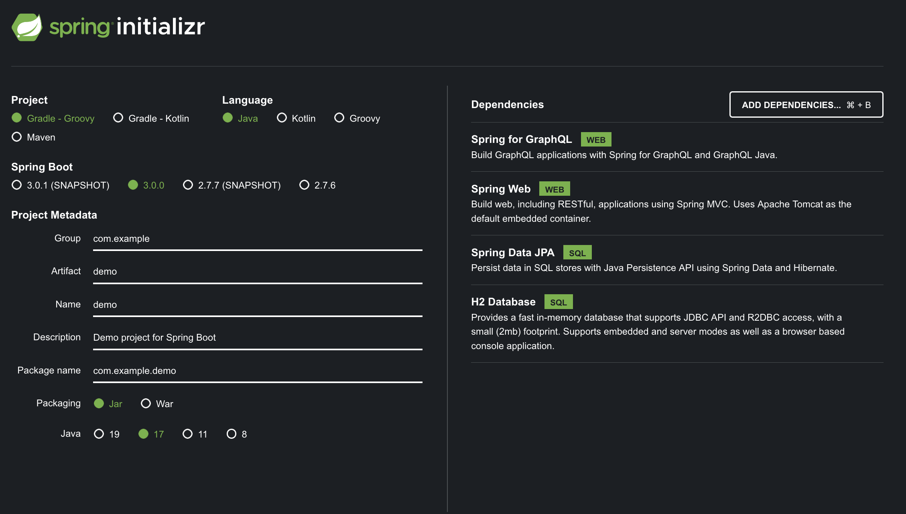
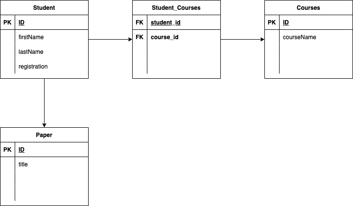

# Graphql Spring Example
This repository is used for demo and testing purposes 
for a lecture in software architectures.
Here, the functionality of GraphQL and Spring is to be 
explored in more detail and subsequently presented to the course.

# Spring Initializer


# DB Relations


# Query examples
```graphql
query {
  student(id: 1) {
    id
    firstName
  }
  students {
    id
    firstName
    lastName
    papers {
      title
    }
    courses {
      id
      courseName
    }
  }
  findStudentsByFirstName(firstName: "Foo") {
    id
    firstName
    lastName
  }
}
```

# Mutation examples
```graphql
mutation {
  createStudent(
    student: {
      id: 20, 
      firstName: "A", 
      lastName: "b", 
      registration: "123"
    }) {
    id
    firstName
    lastName
  }
}
```